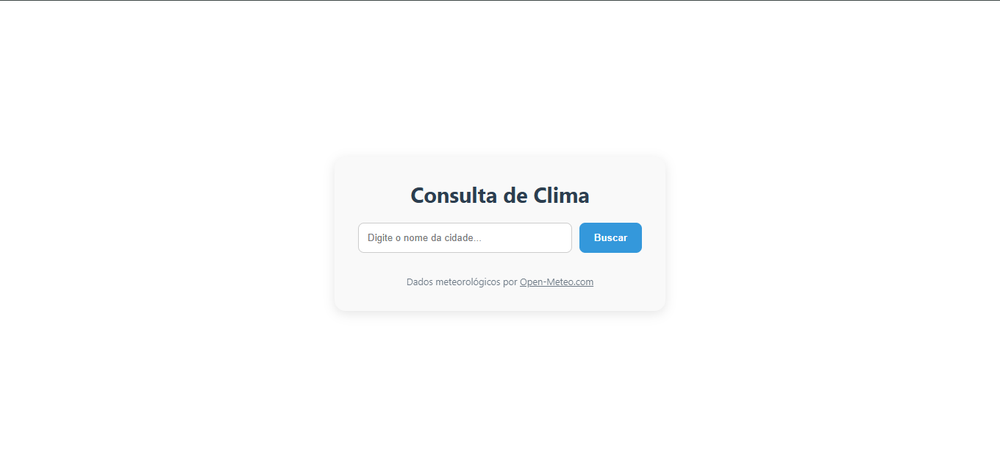
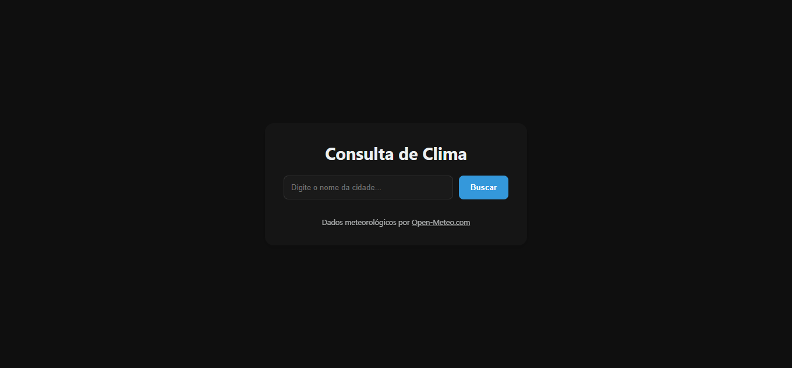
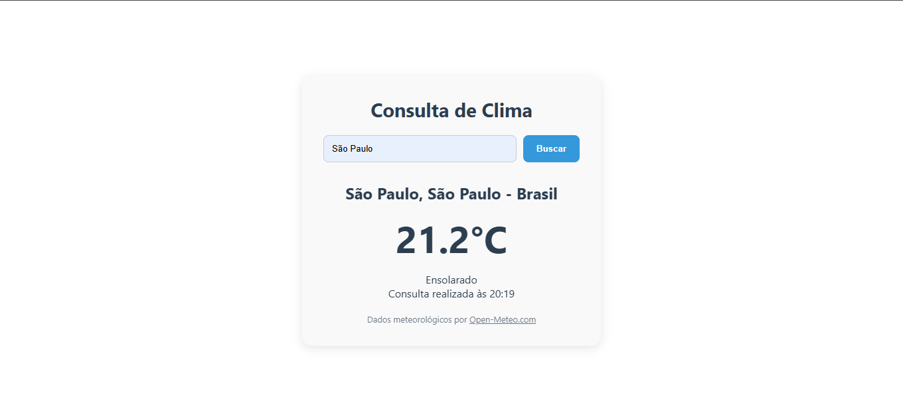
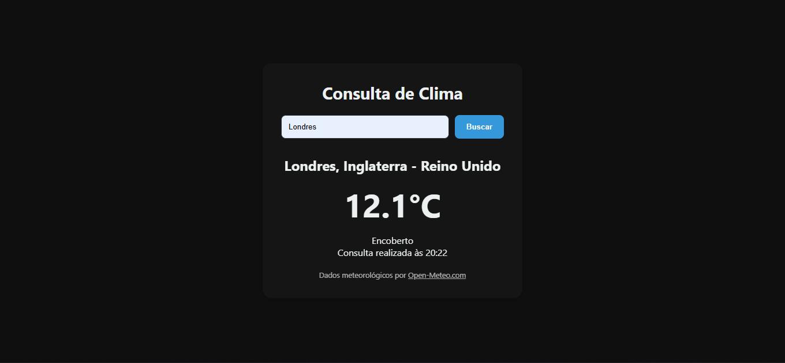

# 🌤️ App de Clima - Consulta Meteorológica

Este é um projeto prático desenvolvido para consulta de clima em tempo real. O aplicativo permite que qualquer pessoa digite o nome de uma cidade e receba instantaneamente a temperatura atual e a condição climática (ex: Céu limpo, Chuva moderada, etc.).

O sistema consome dados reais da API pública [Open-Meteo](https://open-meteo.com/), garantindo informações precisas e atualizadas.

## ✨ Funcionalidades

- **Busca Inteligente:** Encontre o clima de qualquer cidade do mundo.
- **Tratamento de Nomes:** O sistema entende acentos e espaços (ex: "São Paulo" ou "Cuiabá").
- **Temas Dinâmicos (Dia/Noite):** A interface altera automaticamente suas cores entre o modo claro (09h às 18h) e o modo escuro (restante do dia).
- **Localização Detalhada:** Exibição do Estado e País para garantir que você saiba exatamente de onde vêm os dados.
- **Horário da Consulta:** Exibe o momento exato em que as informações meteorológicas foram resgatadas.
- **Mensagens de Erro:** Caso a cidade não seja encontrada ou haja falha na internet, o app avisa você de forma educada.
- **Segurança (Anti-XSS):** Manipulação segura do DOM para evitar injeção de scripts maliciosos.
- **Interface Centralizada:** Design focado na experiência do usuário, mantendo o conteúdo perfeitamente alinhado em qualquer tamanho de tela.

## 🚀 Como Executar o Projeto

Como este projeto utiliza módulos modernos do JavaScript, ele não pode ser aberto simplesmente clicando duas vezes no arquivo HTML. Siga estes passos simples:

1. **Baixe o projeto:** Baixe a pasta completa (ou o arquivo .zip) e extraia no seu computador.
2. **Abra no VS Code:** Abra a pasta do projeto no seu editor Visual Studio Code.
3. **Instale a Extensão:** Procure na aba de extensões por **"Live Server"** (ou similar) e instale-a.
4. **Inicie o App:**
   - Com o arquivo `index.html` aberto, clique no botão **"Go Live"** no canto inferior direito do VS Code.
   - Uma nova aba abrirá automaticamente no seu navegador com o aplicativo funcionando!

## 🧪 Testes Automatizados

O projeto conta com uma suíte de testes integrada que valida a lógica de negócios e o comportamento visual. **Por padrão, os testes estão desativados** para garantir uma navegação fluida e sem interrupções visuais.

### Como ver os testes:

1. No seu navegador, com o app aberto, aperte a tecla **F12** (ou clique com o botão direito e vá em "Inspecionar").
2. Clique na aba **Console**.
3. Caso ativados, você verá os logs das validações de API e o **Teste Visual de Temas**, que alterna as cores da página automaticamente para demonstração.

### Como ativar ou desativar os testes:

Para controlar a execução da suíte de testes, siga os passos abaixo no arquivo `index.html`:

1. Localize a linha próxima ao final do arquivo que faz a chamada do script `js/tests.js`.
2. **Para ativar:** Remova as tags de comentário `<!--` e `-->`.
3. **Para desativar:** Envolva a tag com os comentários, deixando-a desta forma:
   ```html
   <!-- <script type="module" src="js/tests.js"></script> -->
   ```
4. Salve o arquivo e a alteração será aplicada instantaneamente pelo navegador.

## 🛠️ Tecnologias Utilizadas

- **HTML5:** Estrutura da página.
- **CSS3:** Estilização e layout responsivo.
- **JavaScript (ES6+):** Lógica, consumo de API assíncrona e módulos.
- **Open-Meteo API:** Fonte de dados meteorológicos gratuita e aberta.

## ⚖️ Licença e Privacidade

- **Atribuição:** Dados fornecidos por [Open-Meteo.com](https://open-meteo.com/) (CC BY 4.0).
- **Privacidade:** O app não coleta nem armazena dados pessoais dos usuários.

## 📸 Demonstração

### Comparativo: Interface Inicial e Resultados (Dia vs Noite)

<div align="center">
  <!-- Telas Iniciais -->
  
  
  <br>
  <!-- Resultados da Busca -->
  
  
</div>

_Demonstração visual do sistema de temas automáticos e exibição dos dados meteorológicos._

---

_Projeto desenvolvido para fins educacionais._
